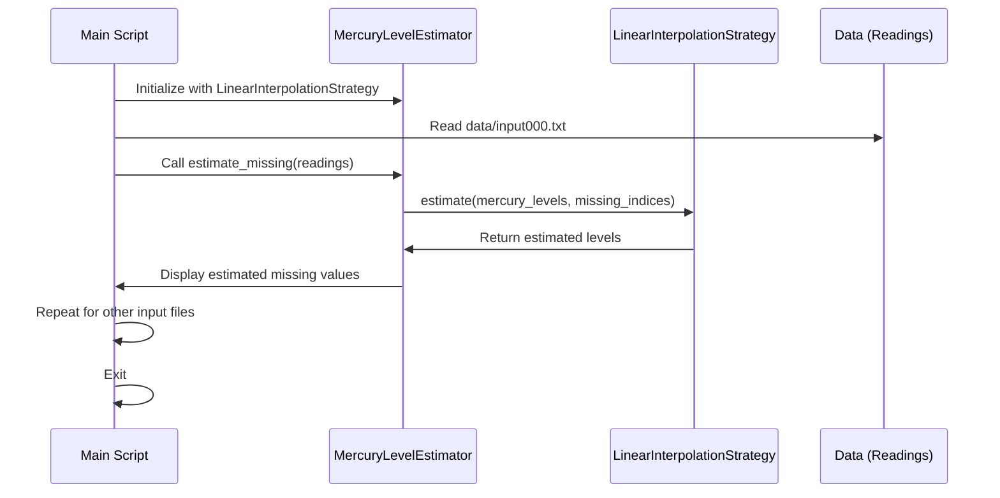

[](https://codecov.io/gh/arturogonzalezm/mercury_level_estimation_python)
[](https://github.com/arturogonzalezm/mercury_level_estimation_python/blob/master/LICENSE)
[](https://github.com/arturogonzalezm/mercury_level_estimation_python/wiki)
[](https://github.com/arturogonzalezm/mercury_level_estimation_python/actions/workflows/workflow.yml)
[](https://github.com/psf/black)

# Mercury Level Estimation Tool

This Python script is designed to estimate missing daily mercury level readings in a river. The data consists of timestamps and mercury levels, with some levels missing and marked accordingly. The script uses linear interpolation to estimate these missing values.

## Instructions:
A time series of daily readings of mercury levels in a river is provided to you. 
In each test case, the day's highest level is missing for certain days. 
By analysing the data, try to identify the missing mercury levels for those days. 
Each row of data contains two tab-separated values: a time-stamp and the day's highest reading.

There are exactly twenty rows marked missing in each input file. 
The missing values marked as "Missing_1", "Missing_2", ....."Missing_20". 
These missing records have been randomly dispersed in the rows of data.

Complete the calcMissing(readings) function in the editor below. 
It should print 20 rows, one for each missing value, as floats in python.

Mercury levels are all < 400. If the missing value is not found, print "Missing".

## Functionality

The core functionality is encapsulated in the `calcMissing(readings)` function. Here's a breakdown of how it works:

### Input Parsing

- The function takes a list of `readings`, where each reading is a string containing a timestamp and a mercury level (or a placeholder for missing values) separated by a tab.
- It then parses each reading, separating the timestamp from the mercury level.
- If the mercury level is marked as missing (e.g., "Missing_1"), the index of this reading is stored for later processing, and `None` is appended to the `mercury_levels` list to represent the missing value. Otherwise, the mercury level is converted to a float and stored.

### Estimating Missing Values

- For each missing value, the script calculates an estimated value using linear interpolation. This involves:
  - Finding the nearest non-missing mercury levels before and after the missing value.
  - Averaging these two values to estimate the missing mercury level.
- If there's no non-missing value before or after the missing value, the script uses the available non-missing value for the estimation. (In practice, this situation should not occur if the data set starts and ends with non-missing values.)

### Output

- The estimated mercury levels for the missing entries are printed to the console, formatted as floats with two decimal places.

## Running the Script

The script is intended to be run with Python 3. Ensure you have a data file named `data/input000.txt` in the same directory as the script. This file should contain the readings, starting with the number of readings on the first line followed by each reading on its own line.

To run the script, simply execute:

```bash
python3 main.py
```

## Strategy Interface

- **File Name:** `estimation_strategy.py`
- **Contents:** Contains the abstract base class `EstimationStrategy` that defines the method signature for estimating strategies.

## Concrete Strategies

- **File Name:** `linear_interpolation_strategy.py`
- **Contents:** Implements the `LinearInterpolationStrategy` class that extends `EstimationStrategy`, providing the concrete implementation for linear interpolation.

- **Future File Name:** `other_strategy.py` (e.g., `nearest_neighbor_strategy.py`, `polynomial_interpolation_strategy.py`)
- **Contents:** Other concrete strategy implementations can be added as separate files, each implementing the `EstimationStrategy` for different estimation methods.

## Context

- **File Name:** `main.py`
- **Contents:** Defines the `MercuryLevelEstimator` class that utilizes an `EstimationStrategy`. This class is responsible for orchestrating the reading of data, applying the estimation strategy, and outputting the results.

## Main Script

- **File Name:** `estimate_missing_levels.py` or simply `main.py`
- **Contents:** Contains the main routine that sets up the necessary objects and triggers the estimation process. This script reads the input data, selects an estimation strategy, and creates an instance of `MercuryLevelEstimator` to estimate and print the missing mercury levels.


